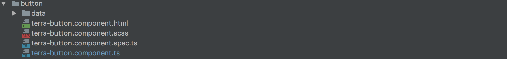
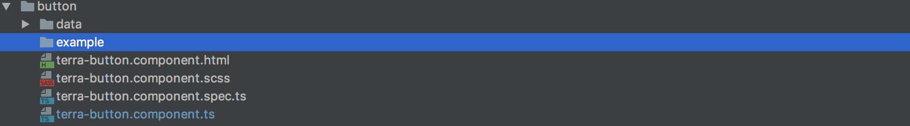
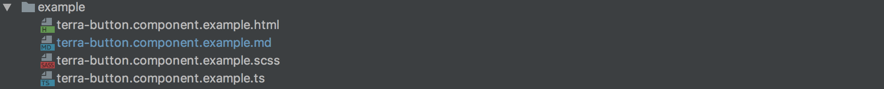
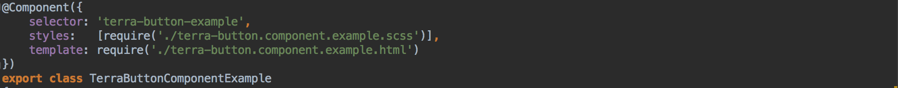
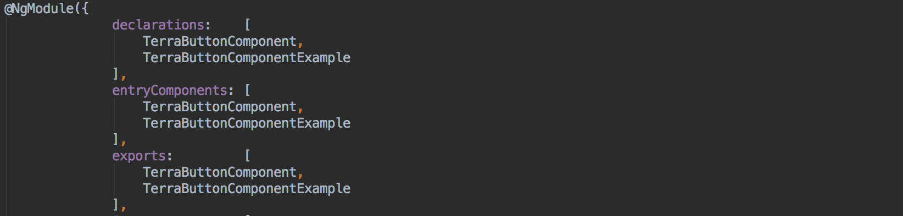
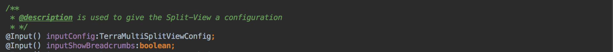
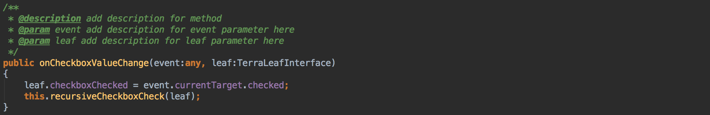
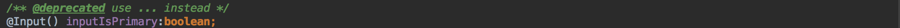
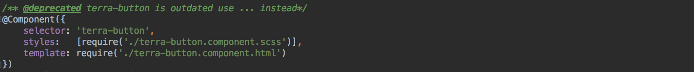

# Developers’ guide

- [Creating an example for a Terra component](#example)
- [Adding a description to a method or property](#description)
- [Adding a description to a method parameter](#paramdescription)
- [Setting components, methods or properties to be deprecated](#deprecated)

## Creating an example for a Terra component

Without an example, the component directory may looks like this:

<space>

If you create a new component or want to add an example to an existing component, this guide will show you which requirements you need to fulfill to ensure the documentation works properly.

##### Creating an example:

1. Create a directory inside the component folder and name it `example` – the name is very important.

<space>

2. Create three files.

- the `.html` , `.scss` , and `.ts` file.
- You can create an `.md` file to show text in the overview.
- The correct convention to name a file is '`selector.component.example.extension`'.
- Example: `terra-button.component.example.ts`

Now the directory should look like this:

<space>

3. Create an angular component.

- The correct convention to name the component `selector` is '`selector`-example'.
- Example: `terra-button-example`
- Link the `.html` and `.scss` file to the component.

<space>

4. Add the new example component to the `NgModule` in the `terra-components.module.ts` file.

- The component you are writing the example for has to be exported in `terra-components.module.ts`.
  <space>

5. Add the component name to `declarations`, `entryComponents`, and `exports`.

<space>

##  Adding a description to a method or property

The `@description` tag has to be directly on top of the function or property you want to add it to.

<space>

	
##  Adding a description to a method parameter

The correct convention to name a file is `@param` `variable name` `description`. The `@param` tag has to be placed directly on top of the function. 
Example: `@param` `orderId` This is the ID of the order.

<space>
 
	
##  Setting components, methods or properties to be deprecated

The `@deprecated` tag has to be placed directly on top of the function or property.

<space>

You can also add the `@deprecated` tag to the whole component to declare it deprecated.

<space>

